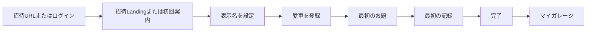
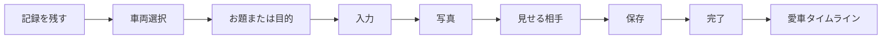
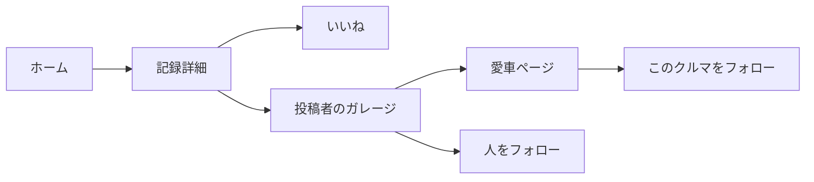
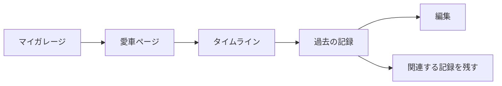
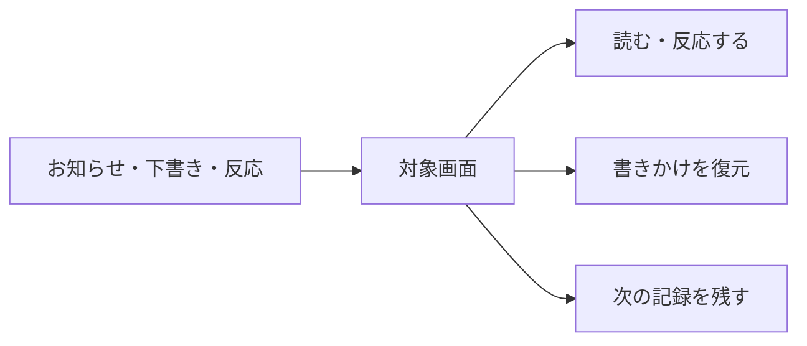
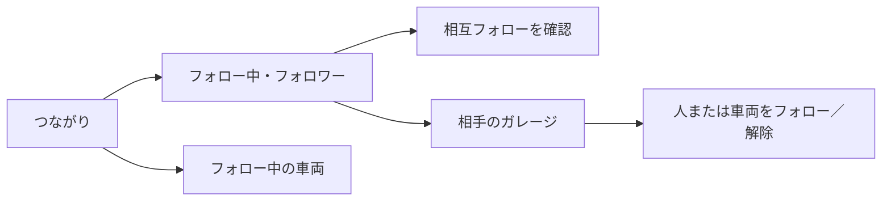

# MECHORI User Flows

## 表記

- `CURRENT`: 現行コードで確認できるルート・機能
- `PROPOSED`: P-074で提案し、試験実装した操作順。人間の実機UX確認前のため確定デザインではない。
- `NEEDS_DECISION`: 実装前に決める事項

画面上の実際の表示順、タップ領域、戻る操作の自然さは、人間による画面確認が必要である。

## A. 初回登録

| 項目 | 内容 |
| --- | --- |
| 開始条件 | 招待URLを受け取る、またはログイン後に車両未登録である |
| CURRENT | Googleログイン、招待Landing、初回3ステップ案内、表示名設定、車両登録、Garage、記録作成の経路がある |
| PROPOSEDの主要ステップ | 招待ではLandingで目的を理解 → 招待・ログイン → 表示名設定 → 愛車登録。通常登録では未ログインHome → ログイン → 3ステップ案内（あとで可能） → 表示名設定 → 愛車登録 → 任意のお題 → 最初の記録 → 完了 → マイガレージ |
| 迷いやすい分岐 | 「新規登録」とGoogleログインの関係、車種候補がない場合、写真なし、年式不明、最初の記録を今書くか後で書くか |
| 失敗状態 | 招待無効、ログイン失敗、登録保存失敗、写真処理失敗。入力と下書きを失わず再試行を示す |
| 完了状態 | 愛車がマイガレージに現れ、最初の記録がその時間軸に加わる |
| 改善が必要な箇所 | P-081Bで招待Landingと表示名設定を追加した。人間QAでは約5秒で目的と最初の行動を理解できるか、招待token／return-to、既存`MECHORI User`救済を確認する |
| 計測したいイベント | `invite_opened`、`auth_completed`、`vehicle_registration_started`、`vehicle_saved`、`first_record_started`、`first_record_saved` |

## B. 記録を残す

| 項目 | 内容 |
| --- | --- |
| 開始条件 | ホーム、Garage、愛車ページ、完了画面、下書き復元から開始する |
| CURRENT | `/journal/new`、車両別作成、さっと記録、お題、写真、公開範囲、下書き、完了導線がある |
| PROPOSEDの主要ステップ | 「記録を残す」 → 車両確認 → お題を選ぶか自由に書く → 入力 → 写真（任意） → 見せる相手 → 保存 → 完了 |
| 迷いやすい分岐 | クイック／詳しいの選択、整備記録との違い、公開範囲、写真だけの公開可否 |
| 失敗状態 | バリデーション、通信、写真共有の失敗。保存されていないことを明示し、入力と下書きを保持する |
| 完了状態 | 愛車名と記録タイトルが時間軸へ加わったことを返す。Garage、記録詳細、次の記録、ホームへ進める |
| 改善が必要な箇所 | 表面上の入力モードを統一し、必要な時だけ整備の詳細欄を開く。写真は記録の公開範囲へ従うと一度だけ説明する |
| 計測したいイベント | `record_entry_opened`、`record_prompt_selected`、`record_saved`、`record_save_failed`、`draft_restored`、`completion_action_selected` |

## C. 他人の記録を見る

| 項目 | 内容 |
| --- | --- |
| 開始条件 | ホームの「みんなの記録」、探す、直接リンク、通知から開く |
| CURRENT | 投稿詳細、いいね、投稿者プロフィール、車両ページ、ユーザー／車両フォローを実装済み |
| PROPOSEDの主要ステップ | 記録を読む → いいねまたは詳細を見る → ○○さんのガレージ → 愛車ページ → 人または車両をフォロー |
| 迷いやすい分岐 | 人をフォローと車両をフォローの違い、参加者内共有と一般公開の違い |
| 失敗状態 | 非公開・削除・権限なし・フォロー保存失敗。内容を漏らさず安全な案内を表示する |
| 完了状態 | 反応、プロフィール閲覧、フォローのいずれかが完了し、フィードに重複なく反映される |
| 改善が必要な箇所 | 投稿者、車両、本文、反応のリンク先を視覚的・操作的に分離する。人と車両のフォロー差を短く説明する |
| 計測したいイベント | `record_opened`、`like_changed`、`owner_garage_opened`、`vehicle_page_opened`、`user_follow_changed`、`vehicle_follow_changed` |

## D. 自分の履歴を見返す

| 項目 | 内容 |
| --- | --- |
| 開始条件 | Garage、保存完了、ホームの愛車要約から開く |
| CURRENT | 現在所有・過去所有・複数車両、タイムライン、記録編集、関連記録追加の経路がある |
| PROPOSEDの主要ステップ | マイガレージ → 愛車を選ぶ → タイムラインを見る → 記録を開く → 編集または次の記録を残す |
| 迷いやすい分岐 | 自分のGarageと他人のGarage、車両ページと記録詳細、過去車の扱い |
| 失敗状態 | 記録なし、写真なし、車両情報不足、編集保存失敗。空状態から最初の記録へ進める |
| 完了状態 | 過去の出来事を確認し、必要なら結果・補足・次の記録を加えられる |
| 改善が必要な箇所 | 愛車ページとタイムラインの関係を一画面の文脈で理解できるようにする。整備記録と日常記録を分断しすぎない |
| 計測したいイベント | `garage_opened`、`vehicle_selected`、`timeline_opened`、`record_edited`、`related_record_started` |

## E. 再訪

| 項目 | 内容 |
| --- | --- |
| 開始条件 | P-073の通知、下書き検出、フォロー中の変化、前回保存の完了導線 |
| CURRENT | 下書き復元とフォロー中の記録はある。通知センターP-073とつながり管理P-075は未実装で、試験実装では準備中画面へ接続する |
| PROPOSEDの主要ステップ | お知らせまたはホーム要約 → 対象の記録・Garage → 反応、復元、次の記録 |
| 迷いやすい分岐 | 通知とホーム新着の重複、下書きがいつ消えるか、反応の種類 |
| 失敗状態 | 通知先が削除・非公開・権限外になった場合、内容を出さず安全な戻り先を示す |
| 完了状態 | 反応、閲覧、下書き復元、次の記録のいずれかが完了する |
| 改善が必要な箇所 | P-073で通知データを独立させ、ホームの新着と役割を分ける |
| 計測したいイベント | `notification_opened`、`notification_target_unavailable`、`draft_prompt_seen`、`return_record_started` |

## F. 検索を実行する

| 項目 | 内容 |
| --- | --- |
| 開始条件 | 「探す」から検索条件を入力する |
| CURRENT | 検索条件フォーム末尾の「この条件で探す」をsubmitとして使い、入力欄からEnter／キーボード検索でも同じ処理を実行する。検索中は記録作成FABを表示しない |
| PROPOSEDの主要ステップ | 条件入力 → この条件で探す → 結果・根拠を確認 → 記録詳細または必要時の記録作成へ進む |
| 迷いやすい分岐 | 検索前、0件、取得エラーを混同しない。0件時だけ「この内容を記録する」を表示する |
| 失敗状態 | 「検索結果を取得できませんでした」と再試行を表示し、入力条件を保持する |
| 完了状態 | 検索結果を確認する、または同じ経験を記録する次の行動を選べる |
| 改善が必要な箇所 | 人間QAで、検索ボタンの視認性、キーボード操作、FAB非表示、下部ナビとの間隔を確認する |
| 計測したいイベント | `search_started`、`search_completed`、`search_empty`、`search_failed`、`search_record_started` |

## G. つながりを確認・管理する（P-075）

| 項目 | 内容 |
| --- | --- |
| 開始条件 | メニューまたは将来の「つながり」画面から開く |
| CURRENT | ユーザー単位・車両単位のフォロー基盤はある。P-075A/B/Cの一覧・公開設定・申請管理画面は未実装で、準備中画面へ接続する |
| PROPOSEDの主要ステップ | つながり → 自分のフォロー中／フォロワー → 相互状態を確認 → 相手のGarageまたは車両へ移動 → フォロー／解除 |
| 迷いやすい分岐 | 人のフォローと車両のフォロー、公開／非公開一覧、非公開Garageの申請状態 |
| 失敗状態 | ブロック、退会、非公開、申請拒否の場合は相手の非公開情報やミュート情報を漏らさず安全な状態を表示する |
| 完了状態 | 人・愛車単位の関係を確認し、必要な対象だけをフォロー／解除できる |
| 改善が必要な箇所 | 友人のつながりから知人を探す導線、申請通知、既存フォローの扱いを段階的に実装する |
| 計測したいイベント | `connections_opened`、`relationship_list_viewed`、`user_follow_changed`、`vehicle_follow_changed`、`follow_request_changed` |

## H. フィードバックを送る

| 項目 | 内容 |
| --- | --- |
| 開始条件 | メニューの「フィードバック」から開く |
| CURRENT | Feedback入力・管理画面はある。入力画面と管理画面には記録作成FABを表示しない |
| PROPOSEDの主要ステップ | フィードバック → 種別を選ぶ → 内容を書く → 送信 → 受付結果または再試行 |
| 迷いやすい分岐 | 「感想」ではなくフィードバックと表示すること、feedbackが実装要求を意味しないこと |
| 失敗状態 | 入力を保持して安全なエラーと再試行を表示する |
| 完了状態 | 受付を確認し、運営が採用・保留・見送りを判断する |
| 改善が必要な箇所 | 種別を罫線表ではなく独立ボタンで表示し、管理画面で未評価・status・種別・期間を絞り込めるようにする |
| 計測したいイベント | `feedback_opened`、`feedback_type_selected`、`feedback_submitted`、`feedback_failed` |
